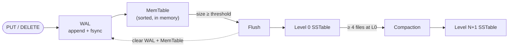
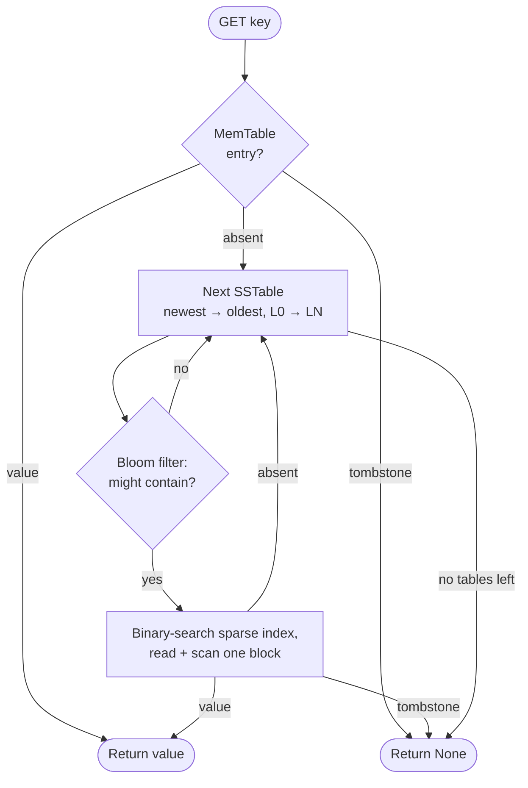
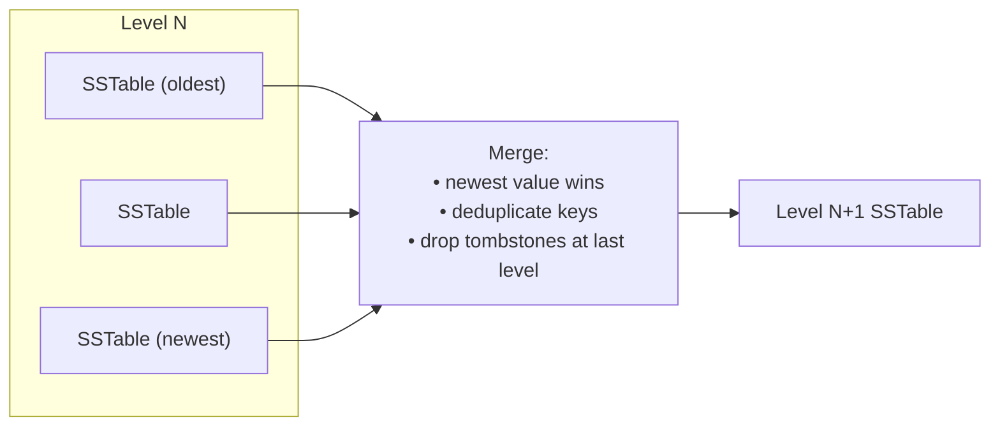

# LSM Tree + SSTable Database in Rust

[](https://github.com/zvdy/lsm-rust/actions/workflows/rust.yml)
[](LICENSE)

An educational, batteries-included implementation of a Log-Structured Merge
Tree (LSM tree) storage engine in Rust — usable as a library or through the
demo binary. It features a durable write-ahead log, tombstone-based deletes,
multi-level compaction, Bloom filters, sparse index blocks, and optional LZ4
block compression.

## Features

- **Durable writes** — every operation is appended to a write-ahead log and
  fsynced before it is acknowledged; torn tail entries are discarded on
  recovery
- **Tombstone deletes** — deletions persist across flushes, compaction, and
  restarts, and shadow older values on disk
- **Multi-level compaction** — newest-value-wins merging with deduplication;
  tombstones are garbage-collected once no older data can be shadowed
- **Bloom filters** — per-table probabilistic filters skip SSTables that
  cannot contain a key
- **Sparse index blocks** — point lookups binary-search a block index and
  read a single block instead of scanning the file
- **Optional LZ4 compression** — per-block compression keeps point reads
  cheap while shrinking tables
- **Concurrent access** — a cloneable `SharedStorage` handle with concurrent
  reads and serialized writes
- **Configurable** — flush/compaction thresholds, level growth, and
  compression are tunable via `StorageConfig`
- **Benchmarked and tested** — a criterion suite covers the hot paths, and a
  dedicated crash-recovery test suite (including model-based random
  workloads across restarts) guards correctness

## Architecture

### Write path



1. Each write is appended to the write-ahead log and fsynced, so it survives
   a crash the moment the call returns.
2. The entry (or a tombstone, for deletes) is inserted into the in-memory
   MemTable.
3. When the MemTable exceeds its size threshold, it is flushed to disk as an
   immutable Level 0 SSTable, and the WAL is cleared.
4. When a level fills up, compaction merges its tables into the next level.

### Read path



The MemTable always has the freshest state, so it is consulted first; a
tombstone found anywhere along the way ends the search immediately, which is
what keeps deleted keys deleted even when older SSTables still hold values
for them.

### Compaction



Level 0 compacts once it holds 4 files; deeper levels compact on a size
threshold that grows by a configurable multiplier per level. Tombstones are
only dropped when no level at or below the output could still contain an
older value for the key.

## On-disk formats

**SSTable (versioned, v2)** — files written by older versions (without the
magic header) remain readable through a legacy fallback path:

```text
┌───────┬─────────┬───────┬─────────────┬─────────────┬───────────────────┐
│ magic │ version │ flags │ bloom       │ sparse      │ data blocks       │
│ LSMT  │ u8 = 2  │ u8    │ len + bytes │ index       │ ≤16 entries each, │
│       │         │       │             │ len + bytes │ LZ4 if flag set   │
└───────┴─────────┴───────┴─────────────┴─────────────┴───────────────────┘

index entry:  [first_key_len u32][first_key][block_offset u64][block_len u32]
data entry:   [key_len u32][key][value_len u32][value]
tombstone:    [key_len u32][key][0xFFFFFFFF]
```

**WAL** — `[op u8][key_len u32][key][value_len u32][value]` per entry, where
`op` is 0 for put (with value) and 1 for delete (without). Replay tolerates a
truncated final entry.

## Usage

### As a library

```rust
use lsm_rust::{Compression, SharedStorage, Storage, StorageConfig};

fn main() -> std::io::Result<()> {
    // Simple: defaults + verbosity flag
    let mut db = Storage::new("./data", false)?;
    db.put(b"name".to_vec(), b"Jane Doe".to_vec())?;
    assert_eq!(db.get(&b"name".to_vec())?, Some(b"Jane Doe".to_vec()));
    db.delete(&b"name".to_vec())?;

    // Tuned: explicit configuration
    let db = Storage::with_config(
        "./data2",
        StorageConfig {
            memtable_size_threshold: 4 * 1024 * 1024, // 4 MB
            compression: Compression::Lz4,
            ..StorageConfig::default()
        },
    )?;

    // Concurrent: cloneable handle, safe to share across threads
    let shared = db.into_shared();
    let handle = shared.clone();
    std::thread::spawn(move || handle.get(&b"key".to_vec())).join().unwrap()?;
    let _ = SharedStorage::new("./data3", false)?; // or construct directly

    Ok(())
}
```

### Demo binary

```bash
cargo run --release        # scripted demo: basic ops + compaction run
cargo run --release -- -v  # with verbose engine logging
```

### Docker

```bash
docker build -t lsm-rust .
docker run -it lsm-rust
```

## Configuration

| `StorageConfig` field | Default | Meaning |
| --- | --- | --- |
| `memtable_size_threshold` | 512 KB | Flush the MemTable to a Level 0 SSTable at this size |
| `compaction_size_threshold` | 1 MB | Base size threshold for level compaction |
| `level_multiplier` | 4 | Growth factor of the threshold per level (`base * multiplier^N`) |
| `level0_file_limit` | 4 | Compact Level 0 at this many files |
| `compression` | `None` | `Compression::Lz4` enables per-block LZ4 |
| `verbose` | `false` | Engine progress logging to stdout |

## Performance

Indicative numbers from the criterion suite on a Linux container (release
build, 128-byte values; run `cargo bench` for your own hardware):

| Operation | Time | Notes |
| --- | --- | --- |
| `put` / `delete` | ~0.9 ms | Dominated by the per-write WAL fsync |
| `get` (MemTable hit) | ~210 ns | Pure in-memory BTreeMap lookup |
| `get` (SSTable hit) | ~4 µs | Index binary search + one block read |
| `get` (missing key) | ~400 ns | Bloom filters avoid disk almost always |

Criterion writes HTML reports to `target/criterion/` and compares against
previous runs, so regressions in the hot paths show up in review.

## Testing

```bash
cargo test              # unit + integration + doc tests
cargo test --test recovery  # crash-recovery suite only
cargo bench             # criterion benchmarks
```

The recovery suite exercises restarts with multi-level data, torn WAL tails,
delete persistence at every lifecycle stage, compressed stores, and a
deterministic model-based random workload verified across restarts.

## Project structure

```text
lsm-rust/
├── src/
│   ├── lib.rs            # Crate root: public API and docs
│   ├── main.rs           # Demo binary
│   ├── storage/
│   │   ├── mod.rs        # Engine: WAL + MemTable + levels + compaction
│   │   └── shared.rs     # SharedStorage: thread-safe handle
│   ├── memtable/mod.rs   # Sorted in-memory table with tombstones
│   ├── sstable/
│   │   ├── mod.rs        # Versioned on-disk tables: bloom, index, blocks
│   │   └── compaction.rs # Level merge policy and merging
│   ├── bloom/mod.rs      # Bloom filter
│   └── wal/mod.rs        # Write-ahead log
├── benches/storage.rs    # Criterion benchmarks
└── tests/recovery.rs     # Crash-recovery integration tests
```

## Roadmap

- [x] SSTable compaction
- [x] Bloom filters for faster lookups
- [x] Index blocks in SSTables
- [x] Concurrent access support
- [x] Configuration options
- [x] Benchmarking suite
- [x] Compression support (LZ4)
- [x] Recovery testing
- [x] Versioned on-disk format
- [ ] Range scans / iterators
- [ ] Background (off-thread) compaction
- [ ] WAL group commit / batched fsync
- [ ] Block cache for hot reads

## Community and Contributing

Contributions of all kinds are welcome — bug reports, documentation, and
code. Please read:

- [CONTRIBUTING.md](CONTRIBUTING.md) — development setup and PR process
- [CODE_OF_CONDUCT.md](CODE_OF_CONDUCT.md) — community standards
- [SECURITY.md](SECURITY.md) — how to report vulnerabilities privately
- [GOVERNANCE.md](GOVERNANCE.md) and [MAINTAINERS.md](MAINTAINERS.md) — how the project is run

## License

MIT License
