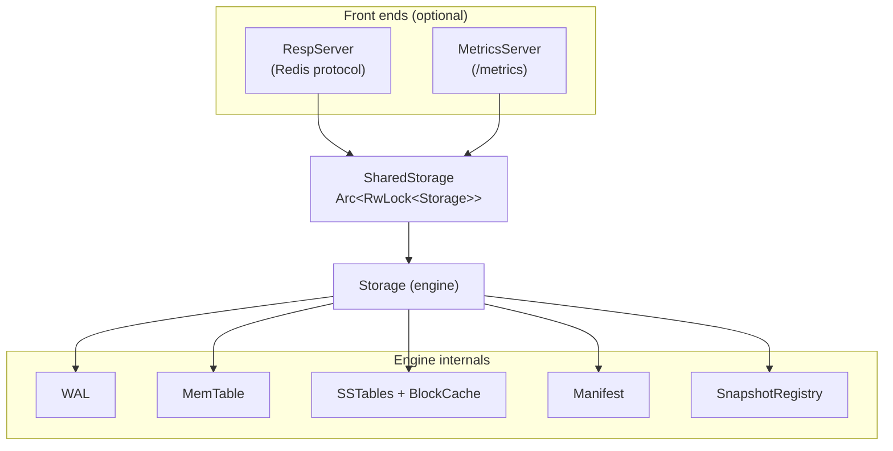

# lsm-rust

[](https://github.com/zvdy/lsm-rust/actions/workflows/rust.yml)
[](https://scorecard.dev/viewer/?uri=github.com/zvdy/lsm-rust)
[](https://github.com/zvdy/lsm-rust/blob/main/Cargo.toml)
[](LICENSE)

A Log-Structured Merge (LSM) tree storage engine in Rust — usable as an
embedded library or served over the Redis protocol. It pairs a durable
write-ahead log and leveled, compacted SSTables with MVCC snapshot isolation,
atomic write batches, and a Prometheus metrics endpoint.

## Features

- **Durable, crash-safe writes** — a write-ahead log fsynced before ack;
  torn-tail entries and orphaned tables are cleaned up on recovery, tracked by
  a crash-atomic manifest.
- **MVCC snapshot isolation** — every write is sequence-numbered; a `Snapshot`
  reads a consistent view unaffected by later writes, flushes, or compactions.
- **Time-travel reads** — revisit the store as of any recorded sequence
  checkpoint with `snapshot_at`; the sequence is persisted, so it survives
  restarts.
- **Atomic write batches** — multiple puts and deletes commit all-or-nothing,
  durably and visibly.
- **Fast reads** — per-table Bloom filters, sparse block indexes, an LRU block
  cache, and optional LZ4 block compression.
- **Leveled compaction** — newest-value-wins merging with tombstone GC, inline
  or on a background thread.
- **Range and prefix scans** — ordered, newest-wins merges across the memtable
  and every level.
- **Concurrency** — a cloneable `SharedStorage` handle: concurrent reads,
  serialized writes.
- **Redis-protocol server** — `lsm-rust serve` speaks RESP, so `redis-cli` and
  Redis client libraries work out of the box.
- **Prometheus metrics** — operation counters and live gauges via
  `Storage::stats()` or a `/metrics` endpoint.

## Architecture



Writes hit the WAL and the in-memory MemTable, which flushes to immutable
Level 0 SSTables; compaction merges levels downward. Reads consult the
MemTable, then SSTables newest-to-oldest, skipping tables via Bloom filters.
For the full write/read/compaction walk-throughs, on-disk formats, and the
MVCC/GC model, see **[docs/ARCHITECTURE.md](docs/ARCHITECTURE.md)**.

## Quick start

### As a library

```rust
use lsm_rust::{Compression, Storage, StorageConfig, WriteBatch};

fn main() -> std::io::Result<()> {
    let mut db = Storage::new("./data", false)?;

    // Basic operations
    db.put(b"name".to_vec(), b"Jane Doe".to_vec())?;
    assert_eq!(db.get(&b"name".to_vec())?, Some(b"Jane Doe".to_vec()));
    db.delete(&b"name".to_vec())?;

    // Snapshot isolation and time-travel
    db.put(b"k".to_vec(), b"v1".to_vec())?;
    let snap = db.snapshot();
    let checkpoint = db.current_sequence(); // survives restarts
    db.put(b"k".to_vec(), b"v2".to_vec())?;
    assert_eq!(db.get_at(&snap, &b"k".to_vec())?, Some(b"v1".to_vec()));
    assert_eq!(db.get_at(&db.snapshot_at(checkpoint)?, &b"k".to_vec())?, Some(b"v1".to_vec()));

    // Atomic write batch and ordered scans
    let mut batch = WriteBatch::new();
    batch.put(b"a".to_vec(), b"1".to_vec()).delete(b"k".to_vec());
    db.write_batch(batch)?;
    let _range = db.scan(b"a", b"z")?;

    // Tuned construction
    let _tuned = Storage::with_config(
        "./data2",
        StorageConfig {
            memtable_size_threshold: 4 * 1024 * 1024,
            compression: Compression::Lz4,
            ..StorageConfig::default()
        },
    )?;
    Ok(())
}
```

A `SharedStorage` handle (via `Storage::into_shared()` or `SharedStorage::new`)
is `Clone + Send + Sync` for concurrent use, and exposes the same API plus
`spawn_compactor()` for background compaction.

### Command line

```bash
make run                               # scripted demo (basic ops + compaction)
make serve                             # serve over the Redis protocol
cargo run --release -- serve --addr 127.0.0.1:6379 --data ./data
```

```text
$ redis-cli
127.0.0.1:6379> SET user:1 "Jane"
OK
127.0.0.1:6379> GET user:1
"Jane"
127.0.0.1:6379> KEYS user:*
1) "user:1"
```

Supported commands: `PING`, `ECHO`, `SET`, `GET`, `DEL`, `EXISTS`,
`KEYS <prefix>*` (trailing-star globs), `QUIT`.

### Prometheus metrics

Add `--metrics-addr` to expose a `/metrics` endpoint alongside the RESP server:

```bash
cargo run --release -- serve --addr 127.0.0.1:6379 --metrics-addr 127.0.0.1:9898
```

Metrics include operation counters (`lsm_puts_total`, `lsm_gets_total`,
`lsm_flushes_total`, `lsm_compactions_total`, …) and gauges for the MVCC
sequence, live snapshots, memtable occupancy, and per-level SSTable counts and
sizes — readable in process via `Storage::stats()` too.


## Configuration

| `StorageConfig` field | Default | Meaning |
| --- | --- | --- |
| `memtable_size_threshold` | 512 KB | Flush the MemTable to a Level 0 SSTable at this size |
| `compaction_size_threshold` | 1 MB | Base size threshold for level compaction |
| `level_multiplier` | 4 | Growth factor of the threshold per level (`base * multiplier^N`) |
| `level0_file_limit` | 4 | Compact Level 0 at this many files |
| `compression` | `None` | `Compression::Lz4` enables per-block LZ4 |
| `wal_sync` | `Always` | `Batched { every_n_writes }` amortizes fsyncs (group commit) |
| `block_cache_size` | 4 MB | Shared LRU block cache capacity (0 disables) |
| `inline_compaction` | `true` | Disable to drive compaction via `compact_now()` or `spawn_compactor()` |
| `verbose` | `false` | Engine progress logging to stdout |

## Performance

Indicative numbers from the criterion suite on a Linux container (release
build, 128-byte values; run `make bench` for your own hardware):

| Operation | Time | Notes |
| --- | --- | --- |
| `put` / `delete` | ~0.9 ms | Dominated by the per-write WAL fsync |
| `get` (MemTable hit) | ~210 ns | In-memory `BTreeMap` lookup |
| `get` (SSTable hit) | ~4 µs (~1 µs cached) | Index binary search + one block read |
| `get` (missing key) | ~400 ns | Bloom filters avoid disk almost always |

## Development

A `Makefile` mirrors CI so you can reproduce a green build locally:

```bash
make            # list all targets
make check      # format, lint, tests, docs — the CI gates
make test       # full test suite (unit + integration + doc tests)
make msrv       # build against the declared minimum Rust version
make deny       # license, advisory, source and ban policy (cargo-deny)
make bench      # criterion benchmarks
```

The minimum supported Rust version is **1.87**, declared in `Cargo.toml` and
verified by CI on every pull request.

The test suite covers the engine, a crash-recovery suite (restarts, torn WAL
tails, delete persistence, and a model-based random workload), and the
snapshot, write-batch, time-travel, and metrics integration suites.

## Project structure

```text
src/
├── lib.rs              # Crate root: public API and docs
├── main.rs             # CLI: demo + serve
├── storage/            # Engine: WAL + MemTable + levels + compaction,
│                       #   SharedStorage, snapshots, manifest, metrics
├── memtable/           # Multi-version sorted in-memory table
├── sstable/            # Versioned on-disk tables + compaction policy
├── bloom/              # Bloom filter
├── wal/                # Write-ahead log
└── server/             # RESP server + Prometheus metrics endpoint
benches/storage.rs      # Criterion benchmarks
tests/                  # Recovery, snapshot, write-batch, time-travel, metrics
docs/ARCHITECTURE.md    # Design deep-dive and on-disk formats
```

## Contributing

Contributions of all kinds are welcome. Please read:

- [CONTRIBUTING.md](CONTRIBUTING.md) — development setup, PR process, releases
- [CHANGELOG.md](CHANGELOG.md) — what changed in each version
- [docs/ARCHITECTURE.md](docs/ARCHITECTURE.md) — how the engine works
- [CODE_OF_CONDUCT.md](CODE_OF_CONDUCT.md) · [SECURITY.md](SECURITY.md) ·
  [GOVERNANCE.md](GOVERNANCE.md) · [MAINTAINERS.md](MAINTAINERS.md)

## License

[MIT](LICENSE)
