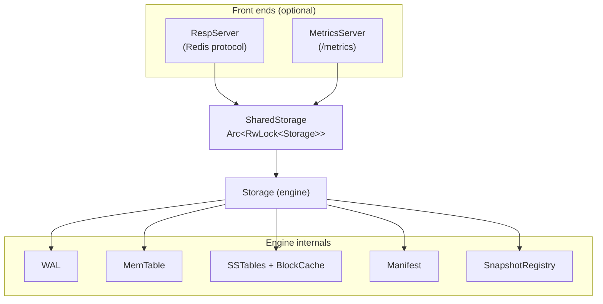
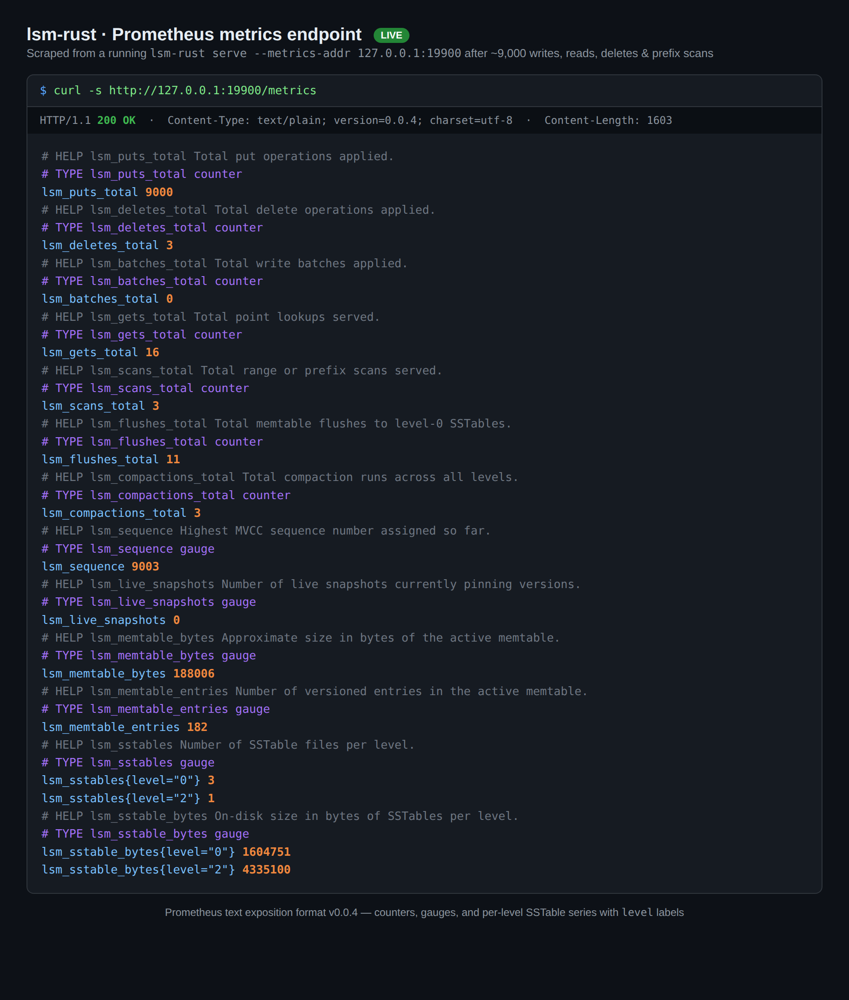

# lsm-rust

[](https://github.com/zvdy/lsm-rust/actions/workflows/rust.yml)
[](https://scorecard.dev/viewer/?uri=github.com/zvdy/lsm-rust)
[](https://github.com/zvdy/lsm-rust/blob/main/Cargo.toml)
[](LICENSE)

A Log-Structured Merge (LSM) tree storage engine in Rust — usable as an
embedded library or served over the Redis protocol. It pairs a durable
write-ahead log and leveled, compacted SSTables with MVCC snapshot isolation,
atomic write batches, and a Prometheus metrics endpoint.

## Features

- **One error type** — every call returns `Result<T, Error>`, and `Error`
  separates corruption, transaction conflicts, invalid arguments and I/O, so
  failures are classified rather than stringly-typed. It converts both ways
  with `std::io::Error`.
- **Durable, crash-safe writes** — a write-ahead log fsynced before ack;
  torn-tail entries and orphaned tables are cleaned up on recovery, tracked by
  a crash-atomic manifest.
- **End-to-end checksums** — a CRC-32 on every SSTable section, every data
  block, and every WAL record turns silent corruption into a clean error
  instead of plausible-looking garbage.
- **Concurrent transactions** — optimistic (`begin`/`commit`/`rollback`) with
  read-your-own-writes, conflict detection at commit, and retriable aborts.
  Serializable by default (catching write skew and phantoms), or snapshot
  isolation when you want fewer aborts.
- **MVCC snapshot isolation** — every write is sequence-numbered; a `Snapshot`
  reads a consistent view unaffected by later writes, flushes, or compactions.
- **Time-travel reads** — revisit the store as of any recorded sequence
  checkpoint with `snapshot_at`; the sequence is persisted, so it survives
  restarts.
- **Consistent checkpoints** — `checkpoint()` writes a point-in-time copy you
  can open as a store. SSTables are hard-linked, so it costs almost nothing up
  front; the WAL is copied, so writes made afterwards cannot leak in.
- **Atomic write batches** — multiple puts and deletes commit all-or-nothing,
  durably and visibly.
- **Fast reads** — per-table Bloom filters, sparse block indexes, an LRU block
  cache, and optional LZ4 block compression.
- **Cost-aware leveled compaction** — newest-value-wins merging with tombstone
  GC, inline or on a background thread. A level whose tables share no keys is
  promoted rather than rewritten, so append-only and time-ordered workloads
  stop paying for merges that cannot reclaim anything.
- **Streaming range and prefix scans** — ordered, newest-wins merges across
  the memtable and every level. `scan_iter` streams one SSTable block at a
  time, so a wide range costs memory proportional to the number of tables, not
  to the size of the range.
- **Concurrency** — a cloneable `SharedStorage` handle: concurrent reads,
  serialized writes.
- **Redis-protocol server** — `lsm-rust serve` speaks RESP, so `redis-cli` and
  Redis client libraries work out of the box.
- **Prometheus metrics** — operation counters and live gauges via
  `Storage::stats()` or a `/metrics` endpoint.

## Architecture



Writes hit the WAL and the in-memory MemTable, which flushes to immutable
Level 0 SSTables; compaction merges levels downward. Reads consult the
MemTable, then SSTables newest-to-oldest, skipping tables via Bloom filters.
For the full write/read/compaction walk-throughs, on-disk formats, and the
MVCC/GC model, see **[docs/ARCHITECTURE.md](docs/ARCHITECTURE.md)**.

## Quick start

### As a library

```rust
use lsm_rust::{Compression, Storage, StorageConfig, WriteBatch};

fn main() -> lsm_rust::Result<()> {
    let mut db = Storage::new("./data", false)?;

    // Basic operations
    db.put(b"name".to_vec(), b"Jane Doe".to_vec())?;
    assert_eq!(db.get(&b"name".to_vec())?, Some(b"Jane Doe".to_vec()));
    db.delete(&b"name".to_vec())?;

    // Snapshot isolation and time-travel
    db.put(b"k".to_vec(), b"v1".to_vec())?;
    let snap = db.snapshot();
    let checkpoint = db.current_sequence(); // survives restarts
    db.put(b"k".to_vec(), b"v2".to_vec())?;
    assert_eq!(db.get_at(&snap, &b"k".to_vec())?, Some(b"v1".to_vec()));
    assert_eq!(db.get_at(&db.snapshot_at(checkpoint)?, &b"k".to_vec())?, Some(b"v1".to_vec()));

    // Atomic write batch and ordered scans
    let mut batch = WriteBatch::new();
    batch.put(b"a".to_vec(), b"1".to_vec()).delete(b"k".to_vec());
    db.write_batch(batch)?;
    let _range = db.scan(b"a", b"z")?;              // collected into a Vec

    // ...or stream it, without materializing the range
    for entry in db.scan_iter(b"a", Some(b"z"))? {
        let (_key, _value) = entry?;
    }

    // Tuned construction
    let _tuned = Storage::with_config(
        "./data2",
        StorageConfig {
            memtable_size_threshold: 4 * 1024 * 1024,
            compression: Compression::Lz4,
            ..StorageConfig::default()
        },
    )?;
    Ok(())
}
```

A `SharedStorage` handle (via `Storage::into_shared()` or `SharedStorage::new`)
is `Clone + Send + Sync` for concurrent use, and exposes the same API plus
`spawn_compactor()` for background compaction.

### Transactions

Transactions are optimistic: they never block each other while running, and
conflicts are resolved at commit time. `transaction()` retries aborts for you,
so contention is handled without lost updates:

```rust
use lsm_rust::SharedStorage;

fn main() -> Result<(), Box<dyn std::error::Error>> {
    let db = SharedStorage::new("./data", false)?;

    // Read-modify-write that is safe under concurrency.
    db.transaction(8, |tx| {
        let current = tx.get(&b"counter".to_vec())?.unwrap_or_else(|| b"0".to_vec());
        let n: u64 = String::from_utf8_lossy(&current).parse().unwrap_or(0);
        tx.put(b"counter".to_vec(), (n + 1).to_string().into_bytes());
        Ok(())
    })?;

    // Or drive one by hand.
    let mut tx = db.begin()?;                   // Serializable by default
    tx.put(b"a".to_vec(), b"1".to_vec());
    assert_eq!(tx.get(&b"a".to_vec())?, Some(b"1".to_vec())); // reads its own writes
    match tx.commit() {
        Ok(seq) => println!("committed at {seq}"),
        Err(e) if e.is_retriable() => println!("conflict — retry"),
        Err(e) => return Err(e.into()),
    }
    Ok(())
}
```

### Checkpoints and backup

Crash recovery and backup are different problems. A process dying is already
handled — the WAL is fsynced before ack and the manifest rename is the commit
point. What that cannot survive is the data itself being destroyed: a deleted
directory, a failed disk, a bad deploy. Checksums do not help either; a CRC-32
turns a rotted block into a clean `Error::Corruption` instead of plausible
garbage, but it cannot rebuild the bytes.

Copying a live data directory by hand does not work — it races compaction, and
every way it loses produces a copy that *opens cleanly* while being silently
wrong. `checkpoint()` holds the store exclusively so the tables, WAL and
manifest it captures are from one instant:

```rust
use lsm_rust::SharedStorage;

fn main() -> lsm_rust::Result<()> {
    let db = SharedStorage::new("./data", false)?;
    let info = db.checkpoint("./backups/2026-09-03")?;
    println!("{} tables, consistent as of seq {}", info.tables, info.sequence);
    Ok(())
}
```

A checkpoint directory *is* a data directory — restore by opening it with
`Storage::new`. There is no separate restore call.

**What it costs.** Almost nothing at first. SSTables are immutable, so they are
captured as hard links rather than copied — a checkpoint of a 10 GB store is
initially some directory entries plus a manifest. The cost accrues later:
when compaction unlinks a table, a checkpoint holding a link keeps the extents
alive, so the real cost is *the bytes compaction has rewritten since the
checkpoint was taken*, not the size of the store. Deleting the checkpoint
directory reclaims it. Checkpoints are therefore meant to be short-lived —
take one, copy it to where backups live, remove it — rather than kept by the
dozen on the same volume.

### Errors

Every fallible call returns `lsm_rust::Result<T>`. `Error` says which kind of
failure it was, so callers can act on it instead of parsing a message:

| Variant | Means | Retriable |
| --- | --- | --- |
| `Error::Corruption` | on-disk bytes failed their checksum or would not parse | no |
| `Error::Conflict { key }` | a transaction lost an optimistic race and had no effect | **yes** |
| `Error::InvalidArgument` | the caller asked for something impossible | no |
| `Error::Io` | the underlying filesystem or socket failed | no |

`Error::is_retriable()` and `Error::is_corruption()` cover the common checks.
`Error` converts to and from `std::io::Error` in both directions — an `Io`
error passes through untouched — so code whose own signatures are still
`std::io::Result` keeps compiling unchanged.

| Isolation | Detects | Allows |
| --- | --- | --- |
| `Isolation::Snapshot` | write-write conflicts | write skew, phantoms |
| `Isolation::Serializable` (default) | write-write, read-write, phantoms in scanned ranges | — |

Uncommitted writes are invisible to everyone else and are discarded if the
transaction is dropped or rolled back. A commit applies the whole write set at
one sequence number, as a single WAL record — all-or-nothing.

### Command line

```bash
make run                               # scripted demo (basic ops + compaction)
make serve                             # serve over the Redis protocol
cargo run --release -- serve --addr 127.0.0.1:6379 --data ./data
```

```text
$ redis-cli
127.0.0.1:6379> SET user:1 "Jane"
OK
127.0.0.1:6379> GET user:1
"Jane"
127.0.0.1:6379> KEYS user:*
1) "user:1"
```

Supported commands: `PING`, `ECHO`, `SET`, `GET`, `DEL`, `EXISTS`,
`KEYS <prefix>*` (trailing-star globs), `QUIT`.

### Prometheus metrics

Add `--metrics-addr` to expose a `/metrics` endpoint alongside the RESP server:

```bash
cargo run --release -- serve --addr 127.0.0.1:6379 --metrics-addr 127.0.0.1:9898
```

Metrics include operation counters (`lsm_puts_total`, `lsm_gets_total`,
`lsm_flushes_total`, `lsm_compactions_total`, `lsm_compaction_moves_total`,
`lsm_checkpoints_total`, …) and gauges for the MVCC
sequence, live snapshots, memtable occupancy, and per-level SSTable counts and
sizes — readable in process via `Storage::stats()` too.



## Configuration

| `StorageConfig` field | Default | Meaning |
| --- | --- | --- |
| `memtable_size_threshold` | 512 KB | Flush the MemTable to a Level 0 SSTable at this size |
| `compaction_size_threshold` | 1 MB | Base size threshold for level compaction |
| `level_multiplier` | 4 | Growth factor of the threshold per level (`base * multiplier^N`) |
| `level0_file_limit` | 4 | Compact Level 0 at this many files |
| `compression` | `None` | `Compression::Lz4` enables per-block LZ4 |
| `wal_sync` | `Always` | `Batched { every_n_writes }` amortizes fsyncs (group commit) |
| `block_cache_size` | 4 MB | Shared LRU block cache capacity (0 disables) |
| `inline_compaction` | `true` | Disable to drive compaction via `compact_now()` or `spawn_compactor()` |
| `verbose` | `false` | Engine progress logging to stdout |

## Performance

Indicative numbers from the criterion suite on a Linux container (release
build, 128-byte values; run `make bench` for your own hardware):

| Operation | Time | Notes |
| --- | --- | --- |
| `put` / `delete` | ~0.9 ms | Dominated by the per-write WAL fsync |
| `get` (MemTable hit) | ~210 ns | In-memory `BTreeMap` lookup |
| `get` (SSTable hit) | ~4 µs (~1 µs cached) | Index binary search + one block read |
| `get` (missing key) | ~400 ns | Bloom filters avoid disk almost always |

## Development

A `Makefile` mirrors CI so you can reproduce a green build locally:

```bash
make            # list all targets
make check      # format, lint, tests, docs — the CI gates
make test       # full test suite (unit + integration + doc tests)
make msrv       # build against the declared minimum Rust version
make deny       # license, advisory, source and ban policy (cargo-deny)
make bench      # criterion benchmarks
```

The minimum supported Rust version is **1.87**, declared in `Cargo.toml` and
verified by CI on every pull request.

The test suite covers the engine, a crash-recovery suite (restarts, torn WAL
tails, delete persistence, and a model-based random workload), and the
snapshot, write-batch, time-travel, and metrics integration suites.

## Project structure

```text
src/
├── lib.rs              # Crate root: public API and docs
├── main.rs             # CLI: demo + serve
├── storage/            # Engine: WAL + MemTable + levels + compaction,
│                       #   SharedStorage, snapshots, manifest, metrics
├── memtable/           # Multi-version sorted in-memory table
├── sstable/            # Versioned on-disk tables + compaction policy
├── bloom/              # Bloom filter
├── wal/                # Write-ahead log
└── server/             # RESP server + Prometheus metrics endpoint
benches/storage.rs      # Criterion benchmarks
tests/                  # Recovery, checkpoint, snapshot, write-batch, errors, …
docs/ARCHITECTURE.md    # Design deep-dive and on-disk formats
```

## Contributing

Contributions of all kinds are welcome. Please read:

- [CONTRIBUTING.md](CONTRIBUTING.md) — development setup, PR process, releases
- [CHANGELOG.md](CHANGELOG.md) — what changed in each version
- [docs/ARCHITECTURE.md](docs/ARCHITECTURE.md) — how the engine works
- [CODE_OF_CONDUCT.md](CODE_OF_CONDUCT.md) · [SECURITY.md](SECURITY.md) ·
  [GOVERNANCE.md](GOVERNANCE.md) · [MAINTAINERS.md](MAINTAINERS.md)

## License

[MIT](LICENSE)
