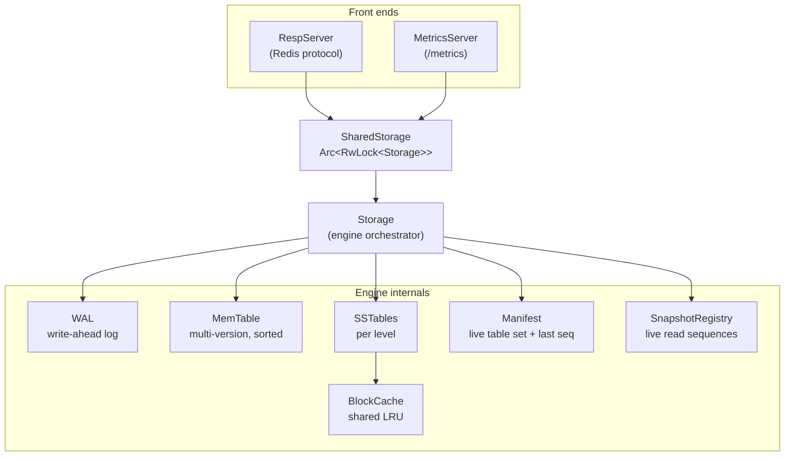
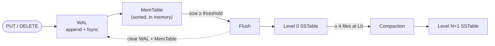
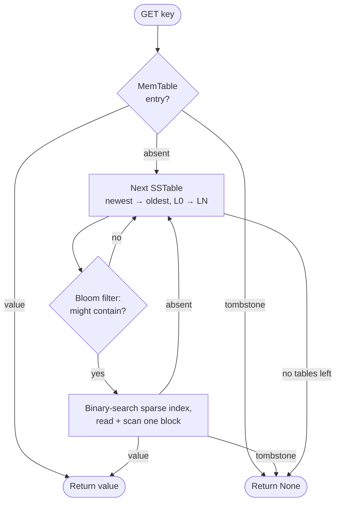
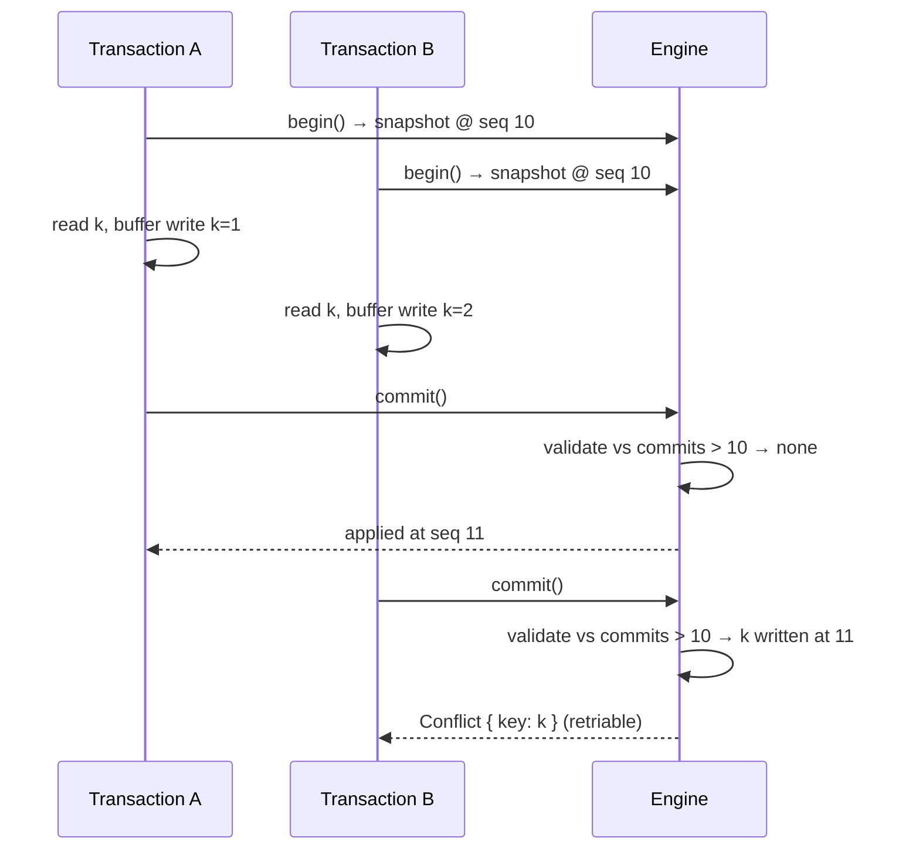
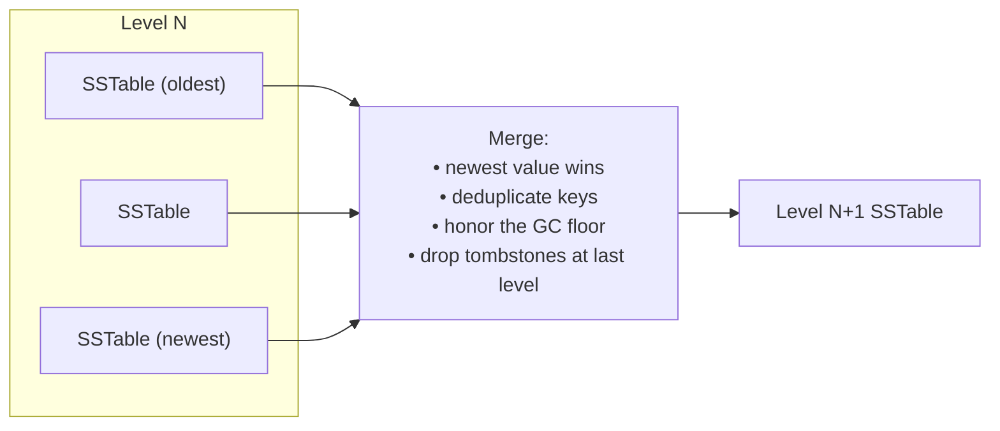
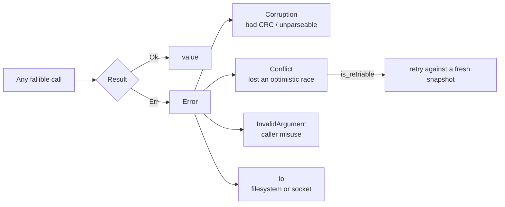

# Architecture

`lsm-rust` is a Log-Structured Merge (LSM) tree storage engine. Writes are
made durable in a write-ahead log and buffered in an in-memory table; that
table is periodically flushed to immutable, sorted on-disk files (SSTables),
which background compaction merges into deeper levels. Reads consult the
in-memory table first, then SSTables from newest to oldest, using per-table
Bloom filters and sparse indexes to avoid unnecessary I/O.

## Components



- **Storage** is the engine: it owns the WAL, the active MemTable, the leveled
  SSTables, the manifest, the snapshot registry, and the block cache, and it
  coordinates the write, read, flush, and compaction paths.
- **SharedStorage** wraps `Storage` in an `Arc<RwLock<…>>` for concurrent use:
  reads take a shared lock and run in parallel; writes take the exclusive lock
  and serialize.
- **RespServer** and **MetricsServer** are optional network front ends over a
  `SharedStorage` — the Redis-protocol endpoint and the Prometheus scrape
  endpoint respectively.

## Write path



1. Each write is appended to the write-ahead log and fsynced, so it survives a
   crash the moment the call returns.
2. The entry (or a tombstone, for deletes) is inserted into the in-memory
   MemTable at the next monotonic sequence number.
3. When the MemTable exceeds its size threshold, it is flushed to disk as an
   immutable Level 0 SSTable, and the WAL is cleared.
4. When a level fills up, compaction merges its tables into the next level.

An **atomic write batch** takes one sequence number for all of its operations
and is written to the WAL as a single framed record, so it is both visible and
durable all-or-nothing.

## Read path



The MemTable always has the freshest state, so it is consulted first; a
tombstone found anywhere along the way ends the search immediately, which is
what keeps deleted keys deleted even when older SSTables still hold values for
them.

### Streaming scans

A range scan merges every source — the memtable and one cursor per SSTable —
through a binary heap ordered by `(key ascending, seq descending)`. All
versions of a key therefore arrive contiguously, newest first, so the merge
takes the first version visible to the scan's snapshot and skips the rest; a
tombstone found there shadows everything older and the key is omitted.

Each SSTable cursor walks the sparse index and reads **one data block at a
time** as the scan advances, so memory is proportional to the number of
sources rather than to the size of the range. `scan_iter` exposes this
directly; `scan` is a convenience wrapper that collects it into a `Vec`.
Because blocks are read lazily, each item is a `Result` — a checksum failure
part-way through a scan surfaces as an error item rather than as a panic or as
silently truncated output.

### Snapshots and time-travel

Every version is tagged with its sequence number, and a read carries a
*snapshot sequence*: it returns, for each key, the newest version whose
sequence is at or below the snapshot. A `Snapshot` captures the current
sequence; `snapshot_at(seq)` captures an arbitrary historical one. Correctness
rests on an LSM invariant — for a given key, a higher sequence always lives in
a newer (shallower) table — so a newest-to-oldest scan can stop at the first
version the snapshot can see.

Holding a snapshot registers its sequence in the **SnapshotRegistry**, which
publishes the oldest live sequence as a garbage-collection floor: compaction
keeps every version newer than the floor and the newest version at or below it,
and drops the rest.

## Transactions

Transactions are **optimistic**: they never take locks while running, so any
number can be in flight at once. A transaction reads from a snapshot taken when
it began and buffers its writes privately; conflicts are resolved only at
commit.



**Validation and application are one atomic step.** Both happen while the
engine's exclusive lock is held, so no commit can slip in between deciding a
transaction is valid and making its writes visible.

### Conflict detection

The engine keeps a `CommitLog`: the write set of each recent commit, keyed by
the sequence it committed at. At commit time a transaction is checked against
every entry newer than its snapshot:

| Check | `Snapshot` | `Serializable` |
| --- | --- | --- |
| Write-write — someone wrote a key we wrote | ✓ | ✓ |
| Read-write — someone wrote a key we read | | ✓ |
| Phantom — someone wrote a key inside a range we scanned | | ✓ |

Every write path feeds the commit log, including plain `put`, `delete` and
`write_batch` — a transaction must conflict with concurrent non-transactional
writes exactly as it does with transactional ones.

The log is bounded, not unbounded history: entries at or below the oldest live
snapshot are pruned, because no transaction can begin before them and so none
can ever be validated against them. With no long-running transaction, only a
couple of entries are retained.

### Guarantees and limits

- A committed transaction applies its whole write set at a single sequence
  number, in one WAL record — atomic in both visibility and durability.
- An aborted or dropped transaction has no effect at all.
- `Serializable` (the default) rules out write skew and phantoms in scanned
  ranges. `Snapshot` is cheaper and aborts less, but permits both.
- Conflict detection is key-granular and range-granular; it does not track
  reads made outside the transaction's own `get`/`scan` calls.

## Compaction



Level 0 compacts once it holds `level0_file_limit` files (4 by default);
deeper levels compact on a size threshold that grows by `level_multiplier` per
level. Tombstones are only dropped when no level at or below the output could
still contain an older value for the key. Compaction can run inline on the
write path or on a dedicated background thread.

## On-disk formats

### SSTable (versioned, v4)

v4 adds a CRC-32 to every section and every data block. v3 (sequence numbers,
no checksums), v2 (no sequence numbers) and pre-header legacy files remain
readable through fallback paths; v2 and legacy entries are treated as
sequence 0.

```text
┌───────┬─────────┬───────┬───────────────────┬───────────────────┬─────────────────┐
│ magic │ version │ flags │ bloom             │ sparse index      │ data blocks     │
│ LSMT  │ u8 = 4  │ u8    │ len + crc + bytes │ len + crc + bytes │ crc + payload   │
└───────┴─────────┴───────┴───────────────────┴───────────────────┴─────────────────┘

section:      [len u32][crc32 u32][body]
data block:   [crc32 u32][payload]        payload = entries, LZ4-compressed if flagged
index entry:  [first_key_len u32][first_key][block_offset u64][block_len u32]
data entry:   [key_len u32][key][seq u64][value_len u32][value]
tombstone:    [key_len u32][key][seq u64][0xFFFFFFFF]
```

Within a block, entries are sorted by `(key ascending, seq descending)` and a
key's versions are never split across blocks, so a snapshot lookup reads a
single block and returns the newest version at or below its sequence. The
`flags` byte records per-block compression (e.g. LZ4).

A block's checksum covers the bytes **as stored** — after compression — so
corruption is caught before the decompressor is handed the data. Section
checksums are verified while opening the table, so a damaged index or bloom
filter fails loudly at open instead of silently mis-routing later lookups.

### Write-ahead log (WAL)

```text
record: [3][crc32 u32][body_len u32][body]

body — one of:
  entry:  [op u8][key_len u32][key][value_len u32][value]
  batch:  [2][count u32] followed by `count` entries
```

`op` is `0` for a put (with value) and `1` for a delete (without). An atomic
write batch is a body introduced by marker `2`, recovered whole or not at all.

Every record written is wrapped in the checksummed frame (marker `3`); the
older unframed markers are still replayed so a log written by an earlier build
stays readable. Replay tolerates a truncated final record, and a *checksum*
failure on the final record is treated the same way — a torn write is
indistinguishable from truncation, so it is dropped and recovery continues. A
checksum failure anywhere earlier in the log is real corruption of durable data
and is reported as an error.

### Manifest

The `MANIFEST` file is the authoritative record of which SSTables are live and
how far the sequence counter has advanced (`last_seq`). It is rewritten
atomically at every flush and compaction commit point; on startup, `.sst` files
not referenced by the manifest are treated as orphans from an interrupted
operation and removed. The persisted `last_seq` is what lets a recorded
sequence checkpoint remain meaningful across restarts for time-travel reads.

## Concurrency model

`SharedStorage` uses a single `RwLock` around the whole engine: coarse-grained,
but simple and correct. Reads (`get`, `scan`, snapshot reads, `stats`) take the
shared lock and proceed concurrently; writes (`put`, `delete`, `write_batch`,
`compact_now`) take the exclusive lock and serialize. The background compactor
holds only a `Weak` reference, so it never keeps the store alive on its own and
stops cleanly when the last handle is dropped.

## Error model

Every fallible call returns `lsm_rust::Result<T>`. A single `Error` enum spans
the whole engine, so failures are classified at the point they are detected
rather than reconstructed from message text by the caller:

| Variant | Raised by | Retriable |
| --- | --- | --- |
| `Corruption(String)` | a CRC mismatch or unparseable structure in an SSTable section, data block, WAL frame, Bloom block or the manifest | no |
| `Conflict { key }` | commit-time validation against the `CommitLog` | **yes** |
| `InvalidArgument(String)` | caller misuse, such as `snapshot_at` beyond the current sequence | no |
| `Io(io::Error)` | the filesystem or a socket | no |

Two properties matter more than the variants themselves.

**Corruption is never silently downgraded.** A checksum mismatch anywhere on
the read path becomes `Corruption`, never a `None` result and never plausible
bytes. The one deliberate exception is a WAL frame whose checksum fails *at the
tail of the file*: that is a torn write from a crash mid-append, indistinguishable
from a truncated tail, so it is dropped during replay rather than reported —
the same treatment a short final record gets. A bad checksum anywhere earlier
is real corruption of durable data and is returned as an error.

**Conflicts are the only retriable failure.** `Error::is_retriable()` is true
for `Conflict` alone, because a losing transaction is rolled back before
anything is written — replaying it against a fresh snapshot is safe. Nothing
else fixes itself on a retry, which is what lets `SharedStorage::transaction`
loop on `is_retriable()` without risking a write being applied twice.



`Error` converts to and from `std::io::Error` in both directions. `From<io::Error>`
lets the engine use `?` over `File` and socket calls; `From<Error> for io::Error`
maps `Corruption` to `InvalidData`, `Conflict` to `WouldBlock` and
`InvalidArgument` to `InvalidInput`, and passes an `Io` error through untouched
so a round trip preserves the original OS error. Callers whose own signatures
are still `io::Result` therefore need no changes.

The RESP and metrics servers keep their private wire helpers on `io::Result`,
since parsing a socket is pure I/O; their public `spawn` entry points return
`lsm_rust::Result`, so the crate's public surface speaks one error type.
